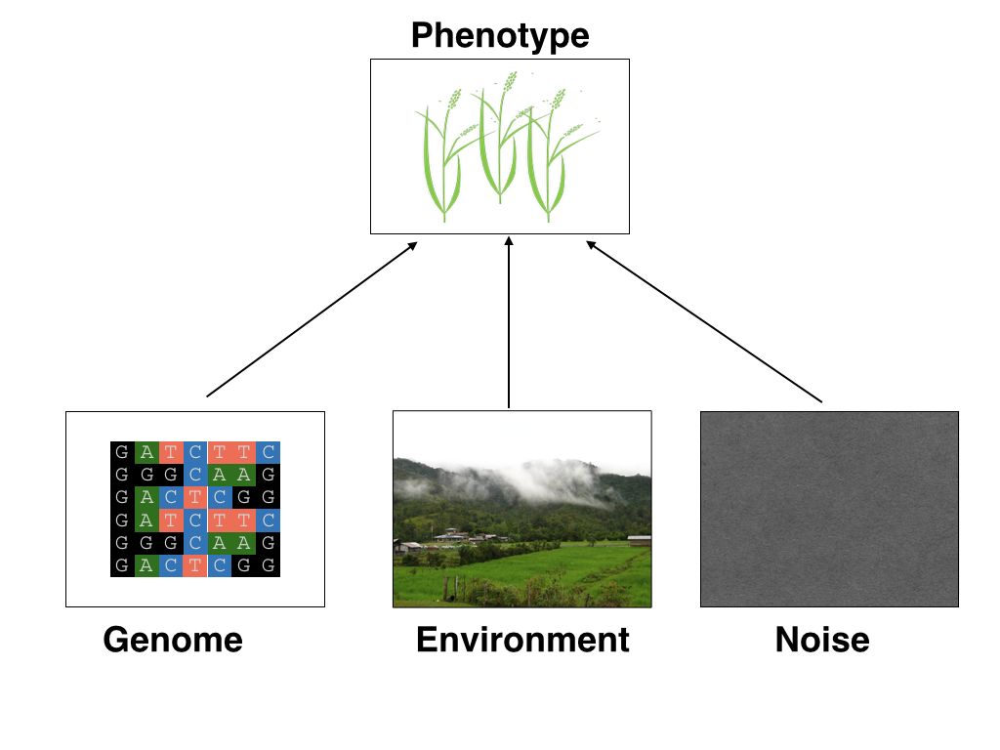
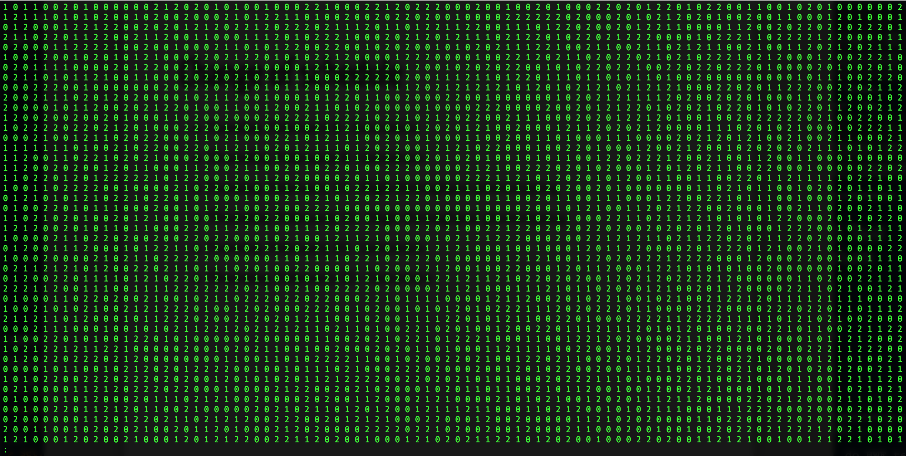

```{r setup, include=FALSE}
options(htmltools.dir.version = FALSE)
```


# About me 


---

# Complex traits



---
# Genetic values
Quantitative genetic model:

\begin{align*}
\mathbf{y} &= \mathbf{g} + \boldsymbol{\epsilon} \\
\end{align*}
where $\mathbf{y}$ is the vector of observed phenotypes, $\mathbf{g}$ is the vector of genetic values, and $\boldsymbol{\epsilon}$ is the vector of residuals. 

Example:

| Plant ID   | y           | g  |   e  |
| ------------- |:-------------:| -----:|------|
| 1      | 10 | ? |  ?     |
| 2      |  7     |   ? |  ?    |
| 3 | 12     |    ? |    ? |


---
# Genetic values
Quantitative genetic model:

\begin{align*}
\mathbf{y} &= \mathbf{g} + \boldsymbol{\epsilon} \\
\end{align*}
where $\mathbf{y}$ is the vector of observed phenotypes, $\mathbf{g}$ is the vector of genetic values, and $\boldsymbol{\epsilon}$ is the vector of residuals. 

Example:

| Plant ID    | y           | g  |   e  |
| ------------- |:-------------:| -----:|------|
| 1      | 10 | 5 |  5     |
| 2      |  7     |   6 |  1    |
| 3 | 12     |    2 |    10 |


--

Phenotypes can be observed and measured but genotypic and additive genetic effects cannot


---
# Precision agriculture using advanced technologies


---
# Precision (digital) phenotyping


.pull-left[
- automated process

- less labor intensive

- less prone to measurement error
]

.pull-right[
<iframe src="https://giphy.com/embed/wW95fEq09hOI8" width="400" height="160" frameBorder="0" class="giphy-embed" allowFullScreen></iframe><p><a href="https://giphy.com/gifs/chihuahua-funny-cute-wW95fEq09hOI8">via GIPHY</a></p>
]


---
# High-throughput phenomics
.pull-left[
<div align="left">
<iframe src="https://innovate.unl.edu/video/leasing-options/greenhouse-innovation-center.mp4" width="250" height="150" frameBorder="0" class="giphy-embed" allowFullScreen></iframe><p><a href="https://innovate.unl.edu/greenhouse-innovation-center">UNL Greenhouse Innovation Center</a>
</p>
</div>

<div align="left">
<iframe width="260" height="200" src="https://www.youtube.com/embed/wor4BFjbIyI?rel=0" frameborder="0" allow="autoplay; encrypted-media" allowfullscreen></iframe>
<p><a href="https://www.youtube.com/watch?v=wor4BFjbIyI">Spidercam</a>
</div>

]

.pull-right[
<div align="right">
<p>Unmanned aerial vehicle<a href="https://www.frontiersin.org/articles/10.3389/fpls.2017.00421/full"> (Watanabe et al. 2017)</a>
</div>
]


---
# Pixelomics


---
# Genomic information (e.g., SNPs)


.center[Repeat of numbers 0, 1, and 2]


---
# Quantitative genetics
Connecting image data with genomic information 
<center>
<div>

=
 + error 
</div>
</center>
\begin{align*}
\mathbf{y} &= \mathbf{g} + \boldsymbol{\epsilon} \\
 &\approx \mathbf{W}\mathbf{a} + \boldsymbol{\epsilon} 
\end{align*}
We approximate unknown $\mathbf{g}$ with $\mathbf{Wa}$. 
\begin{align*}
\underbrace{\begin{bmatrix}    
y_1\\
y_2\\
\vdots \\
y_n\end{bmatrix}}_{n \times 1}  
&= \underbrace{\begin{bmatrix}
   w_{11} & w_{12} & \cdots & w_{1m} \\
    w_{21} & w_{22} & \cdots & w_{2m} \\
    \vdots & \vdots & \ddots & \vdots \\
    w_{n1} & w_{n2} & \cdots & w_{nm}
\end{bmatrix}}_{n \times m} \quad
\underbrace{\begin{bmatrix}
a_1\\
a_2\\
\vdots \\
a_m\end{bmatrix}}_{m \times 1} 
+\underbrace{\begin{bmatrix}
\epsilon_1\\
\epsilon_2\\
\vdots \\
\epsilon_m\end{bmatrix}}_{n \times 1} 
\end{align*}

where $n$ is the number of individuals (e.g., accessions) and $m$ is the number of SNPs. 


---
# Genomic selection


---
# Genomic selection vs. Marker assisted selection


---
# Projected shoot area


---
# Longitudinal Cross-validation


---
# Longitudinal prediction accuracy


---
# Longitudinal GWAS


---
# Persistent and time specific QTL signals


---

# What is quantitative genetics?

--

Population genetics
- **Mathematics** is language of population genetics, **population genetics** is language of **evolution**.

--

Quantitative genetics 
- **Statistics** is language of quantitative genetics, **quantitative genetics** is language of **complex trait genetics**. 

--

**Phenotypes** first in quantitative genetics

In the era of genomics, phenotype is **king**


* Genomic prediction (Genomic selection)

* Genome-wide association study (GWAS)


<center>
<iframe src="https://giphy.com/embed/9ADoZQgs0tyww" width="400" height="200" frameBorder="0" class="giphy-embed" allowFullScreen></iframe><p><a href="https://giphy.com/gifs/obama-awesome-statistics-9ADoZQgs0tyww">via GIPHY</a></p>
</center>


---
# The Morota Lab

[http://morotalab.org/](http://morotalab.org/)


