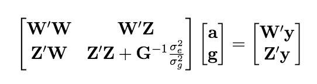
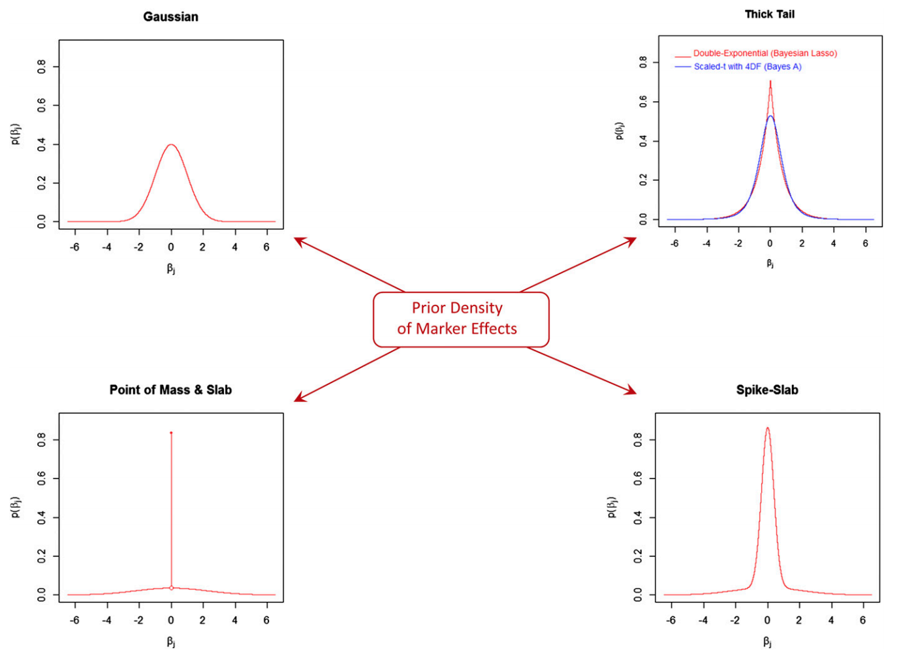

```{r setup, include=FALSE}
options(htmltools.dir.version = FALSE)
```


class: inverse, center, middle

# Treating markers as fixed effects


---
# Extending a linear mixed model for GWAS
Previous model 
$$\mathbf{y = Xb + Zu + e}$$
</br>

Linear mixed model single-marker regression 
$$\mathbf{y = Xb + Wa + Zu + e}$$

- $\mathbf{W}$: marker matrix

- $\mathbf{a}$: vector of marker effect


---
# Linear mixed model for GWAS 
Single marker-based mixed model association (MMA)
\begin{align*}
\mathbf{y} &= \mu + \mathbf{w_ja_j} + \mathbf{Zg} + \boldsymbol{\epsilon} \\
\mathbf{g} &\sim N(0, \mathbf{G}\sigma^2_{g})
\end{align*}

$\mathbf{G}$ captures population structure and polygenic effects


--

Double counting?

--

Alternatively, 
\begin{align*}
\mathbf{y} &= \mu + \mathbf{w_ja_j} + \mathbf{Zg} + \boldsymbol{\epsilon} \\
\mathbf{g} &\sim N(0, \mathbf{G}_{-k}\sigma^2_{g_{-k}})
\end{align*}
where $-k$ denotes the $k$th chromosome removed

See
* Rincent et al. 2014. ([10.1534/genetics.113.159731](https://doi.org/10.1534/genetics.113.159731))

* Chen and Lipka. 2016. ([10.1534/g3.116.029090](https://doi.org/10.1534/g3.116.029090))


---
# How to solve the linear mixed model?

1:  Mixed model equations (MME)
\begin{align*}
\mathbf{y} &= \mu + \mathbf{w_ja_j} + \mathbf{Zg} + \boldsymbol{\epsilon} \\
\end{align*}

The mixed model equations of [Henderson (1949)](http://morotalab.org/literature/pdf/henderson1949.pdf) are given by 

<div align="center">

</div>

2:  Weighted least squares
\begin{align*}
  \hat{\mathbf{a}} &= (\mathbf{W'U T U'W})^{-1}\mathbf{W'U} \mathbf{T} \mathbf{U'y} 
\end{align*}
where

- $\mathbf{U}$: eigenvectors of the $\mathbf{G}$ matrix
- $\mathbf{D}$: eigenvalues of the $\mathbf{G}$ matrix

\begin{align*}
\mathbf{T} = [\mathbf{D}  + \lambda \mathbf{I}  ]^{-1}
\end{align*}


---
# Important literature
Animal 

* [Kennedy et al. 1992.](https://doi.org/10.2527/1992.7072000x) Estimation of effects of single genes on quantitative traits. J Anim Sci. 70:2000-2012.

Plant 

* [Yu et al. 2006.](https://dx.doi.org/10.1038/ng1702) A unified mixed-model method for association mapping that accounts for multiple levels of relatedness. Nat Genet. 38:203-208. 


---
# Ordinary least squares (OLS) 
Quantitative genetic model: $\mathbf{y} = \mathbf{Wa} + \boldsymbol{\epsilon}$

How to find the SNP effects ( $\mathbf{a}$ )?

--

We minimize the residual sum of squares
\begin{align*}
\boldsymbol{\epsilon}' \boldsymbol{\epsilon} &= (\mathbf{y-Wa})'(\mathbf{y-Wa}) \\
&= \mathbf{y}'\mathbf{y}  - \mathbf{y}'\mathbf{W} \mathbf{a}- \mathbf{a}'\mathbf{W}'\mathbf{y} + \mathbf{a}'\mathbf{W}'\mathbf{W}\mathbf{a}  \\
&= \mathbf{y}'\mathbf{y} - 2\mathbf{a}'\mathbf{W}'\mathbf{y} + \mathbf{a}'\mathbf{W}'\mathbf{W}\mathbf{a}
\end{align*}

We take a partial derivative with respect to $\mathbf{a}$
\begin{align*}
  \frac{\partial \boldsymbol{\epsilon\epsilon}'}{\partial \boldsymbol{a}} &= 2 \mathbf{W}'\mathbf{W} \mathbf{a} - 2\mathbf{X}'\mathbf{y}
\end{align*}

By setting the equation equal to zero, we obtain a least square estimator of $\mathbf{a}$. 
\begin{align*}
\mathbf{W}'\mathbf{W} \mathbf{a} &= \mathbf{W}' \mathbf{y} \\
\hat{\mathbf{a}} &= (\mathbf{W}'\mathbf{W})^{-1} \mathbf{W}' \mathbf{y}
\end{align*}


---
# Ordinary least squares (OLS) 
- $\hat{\mathbf{a}}$ is the vector of regression coefficient for markers, i.e., effect size of SNPs

- if the Gauss-Markov theorem is met, $E[\hat{\mathbf{a}}] = \mathbf{a} \rightarrow$ BLUE 
    - $E[\boldsymbol{\epsilon}] = 0$,  $Var[\boldsymbol{\epsilon}] = \mathbf{I}\sigma^2_{\epsilon}$
    

What if  number of SNPs ( $m$ ) $>>$  number of individuals ( $n$ ) ???

--

- $(\mathbf{W}'\mathbf{W})^{-1}$ does not exist 

- Effective degrees of freedom 


---
# OLS: Single marker regression
Test each marker for the presence of QTLs and select those with significant effects

Problems: marker effect sizes are exaggerated

Suppose the true model is given by two causal SNPs 
\begin{align*}
  \mathbf{y} & = \mathbf{w}_1a_1 + \mathbf{w}_2a_2 + \boldsymbol{\epsilon} \\
  \mathbf{y} & = \begin{smallmatrix} \underbrace{\mathbf{W}}_{n \times 2}\underbrace{\mathbf{a}}_{2 \times 1} \end{smallmatrix} + \boldsymbol{\epsilon}
\end{align*}

The OLS estimator for the full mdoel is 
\begin{align*}
  \begin{bmatrix}
    \hat{a}_1 \\
    \hat{a}_2 
  \end{bmatrix} &=
    \begin{bmatrix}
      \mathbf{w}'_1\mathbf{w}_1 & \mathbf{w}'_1\mathbf{w}_2 \\
      \mathbf{w}'_2\mathbf{w}_1 & \mathbf{w}'_2\mathbf{w}_2 
    \end{bmatrix}^{-1}
    \begin{bmatrix}
      \mathbf{w}'_1\mathbf{y} \\
      \mathbf{w}'_2\mathbf{y} \\
    \end{bmatrix} \\
    \hat{\mathbf{a}} &= (\mathbf{W'W})^{-1}\mathbf{W}'\mathbf{y}
\end{align*}


---
# OLS: Single marker regression
The expectation of $\hat{\mathbf{a}}$ is
\begin{align*}
  E(\hat{\mathbf{a}} | \mathbf{W}) = (\mathbf{W'W})^{-1}\mathbf{W'}E(\mathbf{y} ) = (\mathbf{W'W})^{-1}\mathbf{W'Wa} = \mathbf{a}
\end{align*}
which is a nice property of BLUE.

Now, what if we fit a single SNP model $\mathbf{y} = \mathbf{w}_1a_1 + \boldsymbol{\epsilon}$?

The OLS estimate is $\hat{a}_1 = (\mathbf{w'_1w_1})^{-1}\mathbf{w}'_1\mathbf{y}$

The expectation of $\hat{a}_1$ is
\begin{align*}
  E(\hat{a}_1 | \mathbf{w}_1) &= (\mathbf{w'_1w_1})^{-1}\mathbf{w}'_1E(\mathbf{y}) \\
  &= (\mathbf{w'_1w_1})^{-1}\mathbf{w'_1}[\mathbf{w_1a_1 + w_2a_2}] \\
  &= \mathbf{(w'_1w_1)}^{-1}\mathbf{w'_1w_1}a_1 + (\mathbf{w'_1w_1})^{-1}\mathbf{w'_1w_2}a_2 \\
  &= a_1 + (\mathbf{w'_1w_1})^{-1}\mathbf{w'_1w_2}a_2 
\end{align*}

- OLS is biased if full model holds but fit a misspecified model
- this bias is proportional to $(\mathbf{w'_1w_1})^{-1}\mathbf{w'_1w_2}a_2$
- the same applies when there are more than two SNPs 


---
class: inverse, center, middle

# Genomic BLUP


---
# Genomic best linear unbiased prediction
Suppose underlying signal is given by  
$$
\mathbf{y} = \mathbf{g} + \boldsymbol{\epsilon}
$$

where $\mathbf{g} \sim N(0, \mathbf{G}\sigma^2_g)$. 

We approximate the vector of genetic values $\mathbf{g}$ with a linear function  

$$
\mathbf{y} = \mathbf{W}\mathbf{a} + \boldsymbol{\epsilon}
$$

- $\mathbf{W}$ is the centered $n$ $\times$ $m$ matrix of additive marker genotypes 

- $\mathbf{a}$ is the vector of regression coefficients on marker genotypes 

- $\boldsymbol{\epsilon}$ is the residual 


---
# Genomic best linear unbiased prediction
Variance-covariance matrix of $\mathbf{y}$ is
\begin{align*}
\mathbf{V}_y &= \mathbf{V}_g + \mathbf{V}_{\epsilon} \\
&= \mathbf{WW'}\sigma^2_{a} + \mathbf{I} \sigma^2_{\epsilon}
\end{align*}

- $\mathbf{a} \sim N(0, \mathbf{I}\sigma^2_{\mathbf{a}})$  

- $\boldsymbol{\epsilon} \sim N(0, \mathbf{I}\sigma^2_{\boldsymbol{\epsilon}})$

- $\mathbf{V}_g = \mathbf{WW'}\sigma^2_{a}$ is the covariance matrix due to markers


---
# Genomic best linear unbiased prediction
If normality is assumed, the best linear unbiased prediction (BLUP) of $\mathbf{g}$ $(\hat{\mathbf{g}})$ is the conditional mean of $\mathbf{g}$ given the data  
\begin{align}
BLUP(\hat{\mathbf{g}}) &= E(\mathbf{g}|\mathbf{y}) = E[\mathbf{g}] + Cov(\mathbf{g}, \mathbf{y}^T) Var(\mathbf{y})^{-1}  [\mathbf{y} - E(\mathbf{y})] \notag \\
&=  Cov(\mathbf{W}\mathbf{a}, \mathbf{y}^T)\cdot \mathbf{V}_y^{-1}  \mathbf{y}  \notag \\
&= \mathbf{WW'}\sigma^2_{\mathbf{a}} [\mathbf{WW'}\sigma^2_{a} + \mathbf{I} \sigma^2_{\epsilon}]^{-1}  \mathbf{y}  \notag \\
&= [\mathbf{I} +    \frac{\sigma^2_{\epsilon}}{\mathbf{WW'}\sigma^2_{a}} ]^{-1}  \mathbf{y}  \\
&= [\mathbf{I} +  (\mathbf{WW'})^{-1}  \frac{\sigma^2_{\epsilon}}{\sigma^2_{a}} ]^{-1}  \mathbf{y}, 
\end{align}
assuming that $\mathbf{WW'}$ is invertible

- $Cov(\mathbf{W}) = \mathbf{WW'}$  is a covariance matrix of marker genotypes (provided that $X$ is centered), often considered to be the simplest form of additive genomic relationship kernel, $\mathbf{G}$. 


---
# Genomic best linear unbiased prediction
We can refine this kernel $Cov(\mathbf{W}) = \mathbf{WW'}$ by relating genetic variance $\sigma^2_g$ and marker genetic variance $\sigma^2_{a}$ under the following assumptions

Assume genetic value is parameterized as 
$g_{i} = \sum w_{ij} a_j$ 
where both $x$ and $a$ are treated as random and independent. 

Assuming linkage  equilibrium of markers (all loci are mutually independent) 
\begin{align*}
\sigma^2_g &= \sum_j 2 p_j(1-p_j) \cdot \sigma^2_{a_j}. \notag \\
\end{align*}
Under the homogeneous marker variance assumption
\begin{align}
\sigma^2_{a} &= \frac{\sigma^2_g}{2 \sum_j p_j(1-p_j) }.
\end{align}


---
# Genomic best linear unbiased prediction
Recall that 
\begin{align}
BLUP(\hat{\mathbf{g}}) &= [\mathbf{I} +  (\mathbf{WW'})^{-1}  \frac{\sigma^2_{\epsilon}}{\sigma^2_{a}} ]^{-1}  \mathbf{y}, 
\end{align}

Replacing $\sigma^2_{a}$ we get 
\begin{align}
BLUP(\hat{\mathbf{g}}) &= \left [\mathbf{I} +    (\mathbf{WW'})^{-1} \frac{\sigma^2_{\epsilon}}{ \frac{ \sigma^2_{g}}{2 \sum_j p_j(1-p_j)}} \right ]^{-1}  \mathbf{y}  \notag \\ 
&= \left [\mathbf{I} +    \mathbf{G}^{-1} \frac{\sigma^2_{\epsilon}}{ \sigma^2_g} \right ]^{-1}  \mathbf{y}  
\end{align}
where $\mathbf{G} = \frac{\mathbf{WW'}}{2 \sum_j p_j(1-p_j)}$ is known as the first $\mathbf{G}$ matrix  introduced in VanRaden (2008)


---
class: inverse, center, middle

# Ridge regression BLUP


---
## BLUP of marker effects 
Suppose that the phenotype-genotype mapping function is 
\begin{align*}
\mathbf{y} &= \mathbf{g} + \boldsymbol{\epsilon} \\
\mathbf{y} &= \mathbf{W}\mathbf{a} + \boldsymbol{\epsilon} \\
\mathbf{a} &\sim N(0, \mathbf{I}\sigma^2_{a})  
\end{align*}
The conditional expectation of $\mathbf{a}$ given $\mathbf{y}$ is 
\begin{align*}
BLUP(\mathbf{a}) &= E(\mathbf{a}| \mathbf{y})= Cov(\mathbf{a}, \mathbf{y})Var(\mathbf{y})^{-1} [\mathbf{y} - E(\mathbf{y})] \\
&= Cov(\mathbf{a}, \mathbf{W}\mathbf{a}) [\mathbf{W}\mathbf{W'} \sigma^2_{\mathbf{a}}+ \mathbf{I}\sigma^2_{\boldsymbol{\epsilon}}]^{-1} \mathbf{y} \\
&= \sigma^2_{\mathbf{a}} \mathbf{W}' [\mathbf{W}\mathbf{W'} \sigma^2_{\mathbf{a}} + \mathbf{I}\sigma^2_{\boldsymbol{\epsilon}}]^{-1} \mathbf{y} \\
&= \sigma^2_{\mathbf{a}} \mathbf{W'}  (\mathbf{W}\mathbf{W'})^{-1} [ \sigma^2_{\mathbf{a}}\mathbf{I} + (\mathbf{W}\mathbf{W'})^{-1} \sigma^2_{\boldsymbol{\epsilon}}]^{-1}  \mathbf{y} \\
&=  \mathbf{W}^T  (\mathbf{W}\mathbf{W'})^{-1} [ \mathbf{I} + (\mathbf{W}\mathbf{W'})^{-1}  \frac{\sigma^2_{\boldsymbol{\epsilon}}}{\sigma^2_{\mathbf{a}}} ]^{-1}  \mathbf{y}.
\end{align*}

Alternatively,
\begin{align*}
BLUP(\mathbf{a}) &=  \mathbf{W}^T [ (\mathbf{W}\mathbf{W'}) +  \frac{\sigma^2_{\boldsymbol{\epsilon}}}{\sigma^2_{\mathbf{a}}}\mathbf{I} ]^{-1}  \mathbf{y}. 
\end{align*}


---
# BLUP of marker effects 
Thus, 
\begin{align*}
BLUP(\mathbf{a}) &= \mathbf{W}^T  (\mathbf{W}\mathbf{W'})^{-1} [ \mathbf{I} + (\mathbf{W}\mathbf{W'})^{-1}  \frac{\sigma^2_{\boldsymbol{\epsilon}}}{\sigma^2_{\mathbf{a}}} ]^{-1}  \mathbf{y} \\
&=  \mathbf{W'}  (\mathbf{W}\mathbf{W'})^{-1} BLUP(\mathbf{g}).
\end{align*}
Thus, once we obtain $\hat{\mathbf{g}}$ from GBLUP, BLUP of marker coefficients is given by 
$\hat{\mathbf{a}} = \mathbf{W'} (\mathbf{W}\mathbf{W'})^{-1} \hat{\mathbf{g}}$

We arrive at the  same prediction regardless of whether we start from the genotype matrix $\mathbf{W}$ or from $\mathbf{g}$ 


---
# Summary
- GBLUP 
\begin{align*}
\mathbf{y} &= \mathbf{g} + \boldsymbol{\epsilon} \\
\mathbf{g} &\sim N(0, \mathbf{G}\sigma^2_g) \\
\mathbf{G} &= \frac{\mathbf{WW'}}{2 \sum_j p_j(1-p_j)}
\end{align*}


- RR-BLUP
\begin{align*}
\mathbf{y} &= \mathbf{g} + \boldsymbol{\epsilon} \\
\mathbf{y} &= \mathbf{W}\mathbf{a} + \boldsymbol{\epsilon} \\
\mathbf{a} &\sim N(0, \mathbf{I}\sigma^2_{a})  
\end{align*}

- GBLUP and RR-BLUP
\begin{align*}
BLUP(\mathbf{a}) &=  \mathbf{W'}  (\mathbf{W}\mathbf{W'})^{-1} BLUP(\mathbf{g}).
\end{align*}

--

Assumption about marker effects?


---
# Motivation  

- BLUP assumes normally distributed QTL / marker effects

- Does not match the prior information regarding the distributions of QTL / marker effects for some traits

- What if we want to assume QTL / markers have non-Gaussian distribution?


---
# Function f(.)

Search for a function $\mathbf{y} \leftarrow f(\mathbf{W})$ that can deal with 

- dimensionality
    - number of SNP (m) >  number of individuals (n)

- complexity
    - flexible with respect to type of input data (e.g., gene action)


---
# Penalized regression

\begin{align*}
    \mathbf{y} &= \mathbf{Wa} + \boldsymbol{\epsilon}
\end{align*}
  
Penalty function: $\mathbf{J}(\mathbf{a})$, Smoothing parameter: $\lambda$
 
\begin{align*}
  \mathbf{a} &= argmin_{a}[(\mathbf{y} - \mathbf{Wa})' (\mathbf{y} - \mathbf{Wa}) + \lambda \mathbf{J}( \mathbf{a} )]
\end{align*}

Ridge regression (L2 penalty)

- $\mathbf{J}( \mathbf{a} ) =  \sum_{j=1}^{m}a_{j}^2 \rightarrow$ $\hat{\mathbf{a}}_{ridge} = (\mathbf{W}'\mathbf{W}) + \lambda\mathbf{I})^{-1}\mathbf{W}'\mathbf{y}$

- how to pick $\lambda$?

LASSO (L1 penalty)

- $\mathbf{J}(\mathbf{a}) =  \sum_{j=1}^{m}|a_{j}| \rightarrow$ no closed form


---
# Bayes theorem
\begin{align*}
  \begin{cases}
    y: & \text{ observed data } y \sim p(y|\theta)  \\
    \theta : & \text{ parameters (all unobserved quantities) }
    \end{cases}
\end{align*}

\begin{align*}
  p(\theta | y) &= \frac{p(\theta, y)}{p(y)} \\
  &= \frac{ p(y | \theta) p(\theta)  }{ p(y) }  \\
  \underbrace{p(\theta | y)}_{posterior} &\propto \underbrace{p(y | \theta)}_{sampling \text{ } dis} \underbrace{p(\theta)}_{prior} \\
\end{align*}


- posterior = data (likelihood) x prior
- $p(\theta | y)  = f(y|\theta) \cdot p(\theta)$
- all unknowns are treated as random
- predictive distribution
- assign a prior distribution for all unknowns
- derive marginal or conditional posterior


---
# Bayesian penalized regression  $\lambda = \frac{\sigma^2_e}{\sigma^2_{a}}$

Bayesian ridge regression
\begin{align*}
 \hat{a} &=_{argmin} \left[ (\mathbf{y} - \mathbf{W}\mathbf{a})'(\mathbf{y}- \mathbf{W} \mathbf{a}) + \lambda \mathbf{a}' \mathbf{I} \mathbf{a} \right]   \\
   &=_{argmax} \left[ - \frac{1}{2}(\mathbf{y} - \mathbf{W}\mathbf{a})'(\mathbf{y}- \mathbf{W} \mathbf{a}) - \frac{1}{2}  
    \lambda \mathbf{a}' \mathbf{I} \mathbf{a} \right]   \\
   &=_{argmax} \left[ - \frac{1}{2 \sigma^2_e}(\mathbf{y} - \mathbf{W}\mathbf{a})'(\mathbf{y}- \mathbf{W} \mathbf{a}) - \frac{1}{2 \sigma^2_e}  
    \lambda \mathbf{a}' \mathbf{I} \mathbf{a} \right]   \\
   &=_{argmax} \left[ - \frac{1}{2 \sigma^2_e}(\mathbf{y} - \mathbf{W}\mathbf{a})'(\mathbf{y}- \mathbf{W} \mathbf{a}) - \frac{1}{2 \sigma^2_{a}}  
     \mathbf{a}' \mathbf{I} \mathbf{a} \right]   \\
   &=_{argmax}  \exp \left \{  \left[ - \frac{1}{2 \sigma^2_e}(\mathbf{y} - \mathbf{W}\mathbf{a})'(\mathbf{y}- \mathbf{W} \mathbf{a}) - \frac{1}{2 \sigma^2_a}       \mathbf{a}' \mathbf{I} \mathbf{a} \right] \right \}   \\
 &=  \left [ \exp \left \{   - \frac{1}{2 \sigma^2_e}(\mathbf{y} - \mathbf{W}\mathbf{a})'(\mathbf{y}- \mathbf{W} \mathbf{a}) \right \} \exp \left \{ - \frac{1}{2 \sigma^2_{a}}       \mathbf{a}' \mathbf{I} \mathbf{a}  \right \}   \right ] 
\end{align*}

This is proportional to $p(\mathbf{a}| \mathbf{y}, \sigma^2_e, \sigma^2_{a}) \propto p(\mathbf{y}|\mathbf{a}, \sigma^2_e) p(\mathbf{a}| \sigma^2_{a})$, that is, the posterior density of $\mathbf{a}$ (given $\sigma^2_e$ and $\sigma^2_{a}$) 

- $\boldsymbol{y}|\mathbf{a}, \sigma^2_e \sim N(\mathbf{W}\mathbf{a}, \mathbf{I}\sigma^2_e)$

- $\mathbf{a}|\sigma^2_{a} \sim N(0, \mathbf{I} \sigma_{a}^2)$


---
# Bayesian penalized regression $\tilde{\lambda} = \frac{\lambda}{2 \sigma^2_e}$

Bayesian LASSO
\begin{align*}
  \hat{a} &=_{argmin} \left[ (\mathbf{y} - \mathbf{W}\mathbf{a})'(\mathbf{y}- \mathbf{W} \mathbf{a}) +     \lambda | \mathbf{a}' \mathbf{I} | \right]  \\
   &=_{argmax} \left[ - \frac{1}{2}(\mathbf{y} - \mathbf{W}\mathbf{a})'(\mathbf{y}- \mathbf{W} \mathbf{a}) - \frac{\lambda}{2}   | \mathbf{a} \mathbf{I}| \right]   \\
   &=_{argmax} \left[ - \frac{1}{2 \sigma^2_e}(\mathbf{y} - \mathbf{W}\mathbf{a})'(\mathbf{y}- \mathbf{W} \mathbf{a}) - \frac{ \lambda}{2 \sigma^2_e}   | \mathbf{a} \mathbf{I} | \right]   \\
 &=_{argmax} \left[ - \frac{1}{2 \sigma^2_e}(\mathbf{y} - \mathbf{W}\mathbf{a})'(\mathbf{y}- \mathbf{W} \mathbf{a}) - \tilde{\lambda}  
     | \mathbf{a} \mathbf{I} | \right]   \\
   &=_{argmax}  \exp \left \{  \left[ - \frac{1}{2 \sigma^2_e}(\mathbf{y} - \mathbf{W}\mathbf{a})'(\mathbf{y}- \mathbf{W}\mathbf{a}) -  \tilde{\lambda}     \mathbf{a} \mathbf{I} \mathbf{a} \right] \right \}   \\
  &=  \left [ \exp \left \{   - \frac{1}{2 \sigma^2_e}(\mathbf{y} - \mathbf{W}\mathbf{a})'(\mathbf{y}- \mathbf{W} \mathbf{a}) \right \} \exp \left \{ - \tilde{\lambda}  | \mathbf{a} \mathbf{I} | \right \}   \right ] 
\end{align*}

- Gaussian $\times$ Double exponential


---
# BayesRR (ridge regression)
\begin{align*}
    \mathbf{y} = \sum^m_{j=1} \mathbf{W}_{j} a_j + \epsilon
    \rightarrow \mathbf{y}| a_j, \sigma^2_e \sim N(\mathbf{W}_{j} a_j, \sigma^2_e)
\end{align*}
  
$p(\mathbf{a}| \mathbf{y}, \sigma^2_e, \sigma^2_{a}) \propto p(\mathbf{y}|\mathbf{a}, \sigma^2_e) \cdot p(\mathbf{a}| \sigma^2_{a})$

\begin{align*}
        \text{Prior distributions}
    \begin{cases}
          a_j|\sigma^2_{a} \sim N(0,  \sigma_{a}^{2} ) \\
          \sigma^2_{a} \sim \chi^{-2}(\nu, S)  \\
          \sigma^2_{e} \sim \chi^{-2}(\nu, S)
    \end{cases}
\end{align*}

- $\chi^{-2}(\nu, S) \rightarrow$ scaled inverted chi-square distribution with $\nu$ degrees of freedom  and scale parameter $S$ 


---
# BayesL (Lasso)

\begin{align*}
    \mathbf{y} = \sum^m_{j=1} \mathbf{W}_{j} a_j + \epsilon
    \rightarrow \mathbf{y}| a_j, \sigma^2_e \sim N(\mathbf{W}_{j} a_j, \sigma^2_e)
\end{align*}

$p(\mathbf{a}| \mathbf{y}, \sigma^2_e, \sigma^2_{a}) \propto p(\mathbf{y}|\mathbf{a}, \sigma^2_e) \cdot p(\mathbf{a}| \sigma^2_{a})$

\begin{align*}
\text{Prior distributions}
    \begin{cases}
          a_j|\sigma^2_{a_j} \sim N(0,  \sigma_{a_j}^{2} ) \\
          \sigma^2_{a_j} \sim Exponential(\lambda)  \\
          \sigma^2_{e} \sim \chi^{-2}(\nu, S)
    \end{cases}
\end{align*}


---
# BayesA
\begin{align*}
    \mathbf{y} = \sum^m_{j=1} \mathbf{W}_{j} a_j + \epsilon
    \rightarrow \mathbf{y}| a_j, \sigma^2_e \sim N(\mathbf{W}_{j} a_j, \sigma^2_e)
\end{align*}

$p(\mathbf{a}| \mathbf{y}, \sigma^2_e, \sigma^2_{a}) \propto p(\mathbf{y}|\mathbf{a}, \sigma^2_e) \cdot p(\mathbf{a}| \sigma^2_{a})$

\begin{align*}
        \text{Prior distributions}
    \begin{cases}
          a_j|\sigma^2_{a_j} \sim N(0,  \sigma_{a_j}^{2} ) \\
          \sigma^2_{a_j} \sim \chi^{-2}(\nu, S)  \\
          \sigma^2_{e} \sim \chi^{-2}(\nu, S)
    \end{cases}
\end{align*}

- $\chi^{-2}(\nu, S) \rightarrow$ scaled inverted chi-square distribution with $\nu$ degrees of freedom  and scale parameter $S$ 


---
# BayesB
\begin{align*}
    \mathbf{y} = \sum^m_{j=1} \mathbf{W}_{j} a_j + \epsilon
    \rightarrow \mathbf{y}| a_j, \sigma^2_e \sim N(\mathbf{W}_{j} a_j, \sigma^2_e)
\end{align*}

$p(\mathbf{a}| \mathbf{y}, \sigma^2_e, \sigma^2_{a}) \propto p(\mathbf{y}|\mathbf{a}, \sigma^2_e) \cdot p(\mathbf{a}| \sigma^2_{a})$

\begin{align*}
        \text{Prior distributions}
    \begin{cases}
          a_j|\sigma^2_{a_j} \sim N(0,  \sigma_{a_j}^{2} ) \\
          \begin{cases}
            \sigma^2_{a_j} = 0  \quad \text{with probability} \quad \pi\\
            \sigma^2_{a_j} \sim  \chi^{-2}(\nu, S) \quad \text{with probability} \quad (1 - \pi)
          \end{cases} \\
          \sigma^2_{e} \sim \chi^{-2}(\nu, S)
    \end{cases}
\end{align*}

- $\pi$: probability that markers have no effect

- $\chi^{-2}(\nu, S) \rightarrow$ scaled inverted chi-square distribution with $\nu$ degrees of freedom  and scale parameter $S$ 


---
# BayesB* (modified version)
\begin{align*}
    \mathbf{y} = \sum^m_{j=1} \mathbf{W}_{j} a_j + \epsilon
    \rightarrow \mathbf{y}| a_j, \sigma^2_e \sim N(\mathbf{W}_{j} a_j, \sigma^2_e)
\end{align*}

$p(\mathbf{a}| \mathbf{y}, \sigma^2_e, \sigma^2_{a}) \propto p(\mathbf{y}|\mathbf{a}, \sigma^2_e) \cdot p(\mathbf{a}| \sigma^2_{a})$

\begin{align*}
        \text{Prior distributions}
        \begin{cases}
           \begin{cases}
                       a_j =  0  \quad \text{with probability} \quad  \pi  \\
                       a_j|\sigma^2_{a_j} \sim N(0,  \sigma_{a_j}^{2} )  \quad \text{with probability} \quad (1 - \pi)
           \end{cases} \\
           \sigma^2_{a_j} \sim  \chi^{-2}(\nu, S)  \\
          \sigma^2_{e} \sim \chi^{-2}(\nu, S)
    \end{cases}
\end{align*}

- $\pi$: probability that markers have no effect

- $\chi^{-2}(\nu, S) \rightarrow$ scaled inverted chi-square distribution with $\nu$ degrees of freedom  and scale parameter $S$ 


---
# BayesB** (modified version)
\begin{align*}
    \mathbf{y} = \sum^m_{j=1} \mathbf{W}_{j} a_j + \epsilon
    \rightarrow \mathbf{y}| a_j, \sigma^2_e \sim N(\mathbf{W}_{j} a_j, \sigma^2_e)
\end{align*}

$p(\mathbf{a}| \mathbf{y}, \sigma^2_e, \sigma^2_{a}) \propto p(\mathbf{y}|\mathbf{a}, \sigma^2_e) \cdot p(\mathbf{a}| \sigma^2_{a})$

\begin{align*}
        \text{Prior distributions}
        \begin{cases}
           \begin{cases}
                       a_j|\sigma^2_{a_j} \sim N(0,  \sigma_{a_j}^{2} \approx 0)  \quad \text{with probability} \quad  \pi  \\
                       a_j|\sigma^2_{a_j} \sim N(0,  \sigma_{a_j}^{2} )  \quad \text{with probability} \quad (1 - \pi)
           \end{cases} \\
           \sigma^2_{a_j} \sim  \chi^{-2}(\nu, S)  \\
          \sigma^2_{e} \sim \chi^{-2}(\nu, S)
    \end{cases}
\end{align*}

- $\pi$: probability that markers have no effect

- $\chi^{-2}(\nu, S) \rightarrow$ scaled inverted chi-square distribution with $\nu$ degrees of freedom  and scale parameter $S$ 


---
# BayesCpi
\begin{align*}
    \mathbf{y} = \sum^m_{j=1} \mathbf{W}_{j} a_j + \epsilon
    \rightarrow \mathbf{y}| a_j, \sigma^2_e \sim N(\mathbf{W}_{j} a_j, \sigma^2_e)
\end{align*}

$p(\mathbf{a}| \mathbf{y}, \sigma^2_e, \sigma^2_{a}) \propto p(\mathbf{y}|\mathbf{a}, \sigma^2_e) \cdot p(\mathbf{a}| \sigma^2_{a})$

\begin{align*}
        \text{Prior distributions}
        \begin{cases}
           \begin{cases}
                       a_j = 0  \quad \text{with probability} \quad  \pi  \\
                       a_j|\sigma^2_{a} \sim N(0,  \sigma_{a}^{2} )  \quad \text{with probability} \quad (1 - \pi)
           \end{cases} \\
           \pi \sim Uniform(0,1) \\
           \sigma^2_{a} \sim  \chi^{-2}(\nu, S)  \\
          \sigma^2_{e} \sim \chi^{-2}(\nu, S)
    \end{cases}
\end{align*}

- $\pi$: probability that markers have no effect

- $\chi^{-2}(\nu, S) \rightarrow$ scaled inverted chi-square distribution with $\nu$ degrees of freedom  and scale parameter $S$ 


---
# BayesC
\begin{align*}
    \mathbf{y} = \sum^m_{j=1} \mathbf{W}_{j} a_j + \epsilon
    \rightarrow \mathbf{y}| a_j, \sigma^2_e \sim N(\mathbf{W}_{j} a_j, \sigma^2_e)
\end{align*}

$p(\mathbf{a}| \mathbf{y}, \sigma^2_e, \sigma^2_{a}) \propto p(\mathbf{y}|\mathbf{a}, \sigma^2_e) \cdot p(\mathbf{a}| \sigma^2_{a})$

\begin{align*}
        \text{Prior distributions}
        \begin{cases}
           \begin{cases}
                       a_j = 0  \quad \text{with probability} \quad  \pi  \\
                       a_j|\sigma^2_{a} \sim N(0,  \sigma_{a}^{2} )  \quad \text{with probability} \quad (1 - \pi)
           \end{cases} \\
           \sigma^2_{a} \sim  \chi^{-2}(\nu, S)  \\
          \sigma^2_{e} \sim \chi^{-2}(\nu, S)
    \end{cases}
\end{align*}

- $\pi$: probability that markers have no effect

- $\chi^{-2}(\nu, S) \rightarrow$ scaled inverted chi-square distribution with $\nu$ degrees of freedom  and scale parameter $S$ 


---
# Prior densities of a ([de los Campos et al., 2012](https://doi.org/10.1534/genetics.112.143313))


.pull-left[
- Bayes RR (ridge regression)
- BayesL (LASSO)
- BayesA
- BayesB
]


.pull-right[
- BayesB*
- BayesB**
- BayesC
- BayesCpi
]


