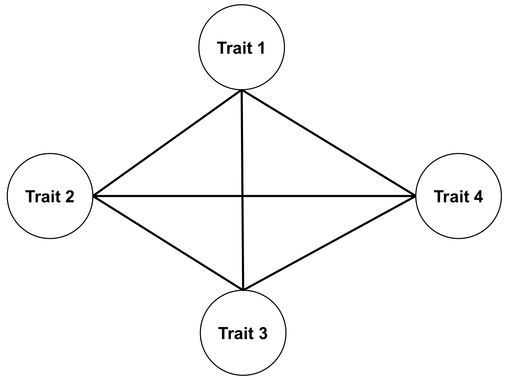
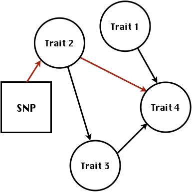
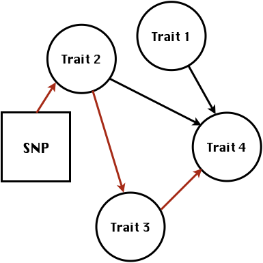

```{r setup, include=FALSE}
options(htmltools.dir.version = FALSE)

library(plotly)
library(tidyverse)
library(htmlwidgets)
```


# Multivariate traits


- Multi-trait GWAS (MTM-GWAS)

- Structural equation model GWAS (SEM-GWAS)


---
# MTM-GWAS


---
# Multiple-trait GWAS (MTM-GWAS)



---
# Interrelationships among traits 


1. Biological prior 
    - previous experiments
    - literature

2. Infer from the data


---
# Phenotypic,  genetic, and residual networks


---
# Structural equation model GWAS (SEM-GWAS)
Direct effect of SNP on Trait 4


---
# SEM-GWAS
Indirect effect of SNP on Trait 4 through Trait 1 (1)


---
# SEM-GWAS
Indirect effect of SNP on Trait 4 through Trait 2 (2)




---
# SEM-GWAS
Indirect effect of SNP on Trait 4 through Trait 2 & 3 (3)




---
# SEM-GWAS
Indirect effect of SNP on Trait 4 through Trait 3 (4)


---
# SEM-GWAS vs. MTM-GWAS
Effect of SNP on Trait 4


\begin{align*}
     \text{Effect of SNP (MTM-GWAS)} &\approx \text{Overall effect (SEM-GWAS)}\\
     &= \text{Direct effect (SEM-GWAS)} \\
     &+ \text{Indirect effect (SEM-GWAS)} 
\end{align*}


---
# How to fit SEM-GWAS?

1. Fit MTM and decompose phenotypes into genetics and residuals

2. Infer the network structure of traits

3. Fit SEM-GWAS given the network structure


Example 1: Chicken data (n = 1,351),  Momen et al. (2018)

- breast muscle (BM)

- body weight (BW)

- hen-house egg production (HHP)


---
# Inferred network structure (1)


Structual equation model


---
# Inferred network structure (2)


Structual equation model


---
# Inferred network structure (3)


Decomposition of SNP effects 


---
# Manhattan plots of BW (overall, direct, and indirect SNP effects)


---
# More details about Chicken SEM-GWAS


---
# Rice data

- Drought data
- Rice diversity panel
    - Projected shoot area
    - Root biomass
    - Water use efficiency
    - Water use
  
Inferred trait network structure


---
# Inferred trait network structure


---
# Structural equation model GWAS (SEM-GWAS)
\begin{align*}
\mathbf{y} =\boldsymbol{\Lambda}  \mathbf{y} + \mathbf{ws} + \mathbf{Zg} + \boldsymbol{\epsilon}
\end{align*}


---
# Structural equation coefficients


---
# Projected shoot area

\begin{align*}
\text{Direct}_{s_j \rightarrow y_{1_{\text{PSA}}}} &= s_{j(y_{1_{\text{PSA}}})} \\
\text{Total}_{s_j \rightarrow y_{1_{\text{PSA}}}} &= \text{Direct}_{s_j \rightarrow y_{1_{\text{PSA}}}}\\
&= s_{j(y_{1_{\text{PSA}}})}
\end{align*}


---
# Root biomass
\begin{align*}
\text{Direct}_{s_j \rightarrow y_{2_{\text{RB}}}} &=s_{j(y_{2_{\text{RB}}})} \\
\text{Total}_{s_j \rightarrow y_{2_{\text{RB}}}} &= \text{Direct}_{s_j \rightarrow y_{2_{\text{RB}}}}\\
&= s_{j(y_{2_{\text{RB}}})}
\end{align*}


---
# Water use
\begin{align*}
\text{Direct}_{s_j \rightarrow y_{3_{\text{WU}}}} &=s_{j(y_{3_{\text{WU}}})} \\
\text{Indirect(1)}_{s_j \rightarrow y_{3_{\text{WU}}}} &= \lambda_{13}s_{j(y_{1_{\text{PSA}}})} \\
\text{Indirect(2)}_{s_j \rightarrow y_{3_{\text{WU}}}} &= \lambda_{23}s_{j(y_{2_{\text{RB}}})} \\
\text{Total}_{s_j \rightarrow y_{2_{\text{WU}}}} &= \text{Direct}_{s_j \rightarrow y_{2_{\text{WU}}}} + \text{Indirect(1)}_{s_j \rightarrow y_{3_{\text{WU}}}} + \text{Indirect(2)}_{s_j \rightarrow y_{3_{\text{WU}}}}\\
&= s_{j(y_{3_{\text{WU}}})} + \lambda_{13}s_{j(y_{1_{\text{PSA}}})} + \lambda_{23}s_{j(y_{2_{\text{RB}}})}
\end{align*}


---
# Water use efficiency
\begin{align*}
\text{Direct}_{s_j \rightarrow y_{4_{\text{WUE}}}} &=s_{j(y_{4_{\text{WUE}}})} \\
\text{Indirect(1)}_{s_j \rightarrow y_{4_{\text{WUE}}}} &= \lambda_{14}s_{j(y_{1_{\text{PSA}}})} \\
\text{Indirect(2)}_{s_j \rightarrow y_{4_{\text{WUE}}}} &= \lambda_{34}s_{j(y_{3_{\text{WU}}})} \\
\text{Indirect(3)}_{s_j \rightarrow y_{4_{\text{WUE}}}} &= \lambda_{13}\lambda_{34}s_{j(y_{1_{\text{PSA}}})} \\
\text{Indirect(4)}_{s_j \rightarrow y_{4_{\text{WUE}}}} &= \lambda_{23}\lambda_{34}s_{j(y_{2_{\text{RB}}})} \\
\text{Total}_{S_j \rightarrow y_{4_{\text{WUE}}}} &= \text{Direct}_{s_j \rightarrow y_{4_{\text{WUE}}}} + \text{Indirect(1)}_{s_j \rightarrow y_{4_{\text{WUE}}}} \\
&+ \text{Indirect(2)}_{s_j \rightarrow y_{4_{\text{WUE}}}} + \text{Indirect(3)}_{s_j \rightarrow y_{4_{\text{WUE}}}} \\
&+ \text{Indirect(4)}_{s_j \rightarrow y_{4_{\text{WUE}}}}\\
&= s_{j(y_{4_{\text{WUE}}})} + \lambda_{14}s_{j(y_{1_{\text{PSA}}})} + \lambda_{34}s_{j(y_{3_{\text{WU}}})} \\
&+ \lambda_{13}\lambda_{34}s_{j(y_{1_{\text{PSA}}})} + \lambda_{23}\lambda_{34}s_{j(y_{2_{\text{RB}}})} 
\end{align*}

---
# Water use efficiency


---
# Preprint


---
# Ongoing SEM-GWAS projects

- Italian Brown Swiss cattle (University of Padua)
    - Milk yield
    
    - Milk pH
    
    - Milk lactose
    
    - Somatic cell score
    
    - Non-casein N
    
    


